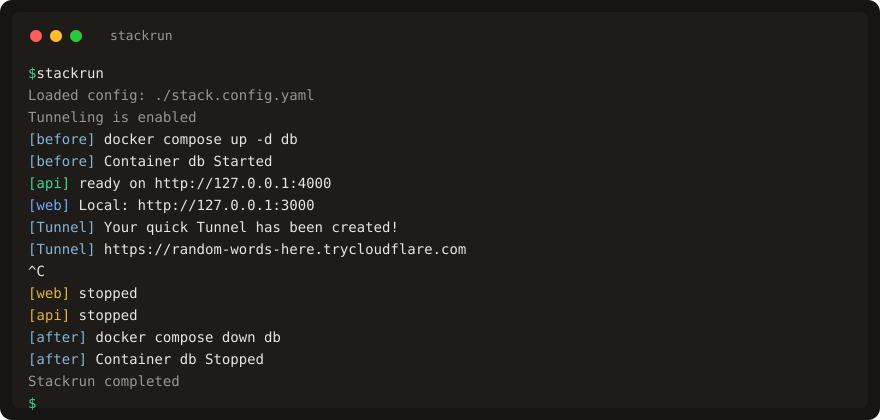

# 🥞 stackrun 🏃

[](https://github.com/jasenmichael/stackrun/actions/workflows/ci.yml)

<!-- automd:badges license -->
<!-- /automd -->

stackrun is a process-orchestration CLI. It is an alternative to running a local stack with [concurrently](https://www.npmjs.com/package/concurrently), [npm-run-all2](https://www.npmjs.com/package/npm-run-all2), [Wireit](https://github.com/google/wireit), or native shell operators (`&`, `wait`, `&&`).

Those tools stay inside npm scripts or a single shell. stackrun is a standalone binary: any language, prefixed logs, `before` / `after` hooks, and optional Cloudflare tunnels.

Commands are opaque processes. Python, Node, Go, shell, or any executable works. Node evaluates JS/TS config files and, in the npm package, shims `stackrun` / `import { stackrun }`.

## Features

- One config file for a local stack
- Concurrent processes with `[name]` prefixes (color on the name only); stackrun-owned lines use `[stackrun]` the same way
- Ctrl+C stops every command, then runs `after`, then exits 0 unless a command already failed
- JSON, JSONC, JSON5, YAML, TOML, `.env`, and `.stackrc`
- Optional JS/TS config (`node` plus local `jiti`, or `--jiti npx`)
- Lifecycle hooks (`before` / `after`)
- Per-command `env`, `cwd`, and `tunnel.env`
- One-off runs with `--command` (no config file)
- `--dry-run` prints the loaded config as JSON
- Per-command Cloudflare tunnels: quick (`*.trycloudflare.com`) or named (your zone)

## Requirements

Unix is the primary platform. On SIGINT, Stackrun stops each child process group. Windows uses `cmd /c` without that extra group handling.

`cloudflared` is needed **only for tunnels**. No `tunnel` key, or `tunnel: false`, means stackrun does not look for it.

Install when you use tunnels:

```sh
# macOS
brew install cloudflared
# Windows
winget install Cloudflare.cloudflared
# Linux: see Cloudflare's install page
```

Quick tunnels (`tunnel.local` only) need the binary. Named tunnels (`public` set) also need one login: `cloudflared tunnel login`. No API token.

Node is needed only for the npm package (`npx`, `npm i`, or `import { stackrun }`) or for JS/TS config files. See [JS/TS config](#jsts-config). YAML, TOML, and JSON need no Node.

A Rust toolchain is needed only when [building from source](#from-source).

## Installation

### GitHub Releases

No Rust or Node. The install script detects OS/arch, downloads the matching archive, checks `SHA256SUMS`, and puts `stackrun` in `~/.local/bin`.

```sh
curl -fsSL https://jasenmichael.github.io/stackrun/install.sh | sh
```

Pin a version or install directory:

```sh
curl -fsSL https://jasenmichael.github.io/stackrun/install.sh | STACKRUN_VERSION=1.0.0 sh
curl -fsSL https://jasenmichael.github.io/stackrun/install.sh | STACKRUN_INSTALL=/usr/local/bin sh
```

The script and landing page live on GitHub Pages (`docs` branch): https://jasenmichael.github.io/stackrun/

Manual install: pick an archive from [GitHub Releases](https://github.com/jasenmichael/stackrun/releases). Names are `stackrun-v<version>-<target>.tar.gz` (Unix) or `.zip` (Windows).

Targets: Linux x64/arm64 (`*-unknown-linux-gnu`), macOS Intel/Apple Silicon (`*-apple-darwin`), Windows x64/arm64 (`*-pc-windows-msvc`).

Extract `stackrun` (or `stackrun.exe`) onto your `PATH`. Windows has no curl script; use the zip.

```sh
# Example: Linux x86_64 (gnu). Get the archive and SHA256SUMS from the release.
tar -xzf stackrun-v1.0.0-x86_64-unknown-linux-gnu.tar.gz
sudo mv stackrun-v1.0.0-x86_64-unknown-linux-gnu/stackrun /usr/local/bin/
sha256sum -c SHA256SUMS
```

### crates.io

Needs `cargo` because cargo builds the crate.

```sh
cargo install stackrun
```

### npm

Needs Node. One npm package (`stackrun`). Install downloads the matching GitHub Release binary for this OS/arch. See [Programmatic API](#programmatic-api) for `import { stackrun }`.

```sh
npx stackrun
npm i -g stackrun
npm i -D stackrun   # then ./node_modules/.bin/stackrun
```

<!-- automd:pm-install name="stackrun" -->
<!-- /automd -->

<!-- automd:pm-x name="stackrun" -->
<!-- /automd -->

### From source

A [Rust](https://rustup.rs/) stable toolchain (`rust-toolchain.toml` pins `stable`).

```sh
git clone https://github.com/jasenmichael/stackrun
cd stackrun
cargo install --path .
```

This puts `stackrun` on your PATH.

Or run from the repo without installing:

```sh
cargo run -- --help
```

A release build writes `target/release/stackrun`:

```sh
cargo build --release
```

## Quick start

```sh
stackrun
stackrun --config ./stack.config.yaml
stackrun --command "python server.py"
```

One stack: start a Docker DB, run api + web, expose web, tear the DB down.

**Quick tunnel** (no `public`). URL is a new `https://<id>.trycloudflare.com` each run, in the `[Tunnel]` log. Needs `cloudflared`. No login.

```yaml
# stack.config.yaml
before:
  # Sequential. Inherited stdio. A failed hook aborts — no commands, no tunnels.
  - docker compose up -d db
after:
  # Always runs after commands have exited (ok, fail, or Ctrl+C). Not skipped on failure.
  # Use this to tear down docker / temp files. A failed after hook still fails the run.
  - docker compose down db
commands:
  - name: api
    run: npm run dev
    cwd: ./api
    color: green
  - name: web
    run: npm run dev
    cwd: ./web
    color: blue
    tunnel:
      local: http://127.0.0.1:3000
```



[Play this recording](https://jasenmichael.github.io/stackrun/#demo) on the docs site.

**Named tunnel** (add `public`). URL is exactly that hostname. Needs `cloudflared tunnel login` and the name on your zone.

```yaml
    tunnel:
      local: http://127.0.0.1:3000
      public: https://web.example.dev
```

- Omit `public` → quick → new `*.trycloudflare.com` each run.
- Set `public` → named → URL is `public`.
- No `tunnel` key → no cloudflared, no public URL.

`killOthers: failure` (default) kills siblings when one command exits non-zero. It does not control `after`. `after` always runs once commands have exited, unless `before` failed or the run never started.

Put the file in the project root and run `stackrun`.

## Programmatic API

The npm package exports `stackrun` and `defineStackrunConfig`. Both spawn the native binary. They do not run the stack in Node.

<!-- automd:jsimport name="stackrun" imports="stackrun,defineStackrunConfig" -->
<!-- /automd -->

```ts
import { stackrun, defineStackrunConfig } from "stackrun";

export default defineStackrunConfig({
  commands: [{ name: "api", run: "npm run dev", cwd: "./api" }],
});

await stackrun();
await stackrun({ commands: [{ name: "api", run: "npm run dev" }] });
```

## How it works

Stackrun loads one config from the current directory, then applies `.env`, `.stackrc`, local `extends`, and `NODE_ENV` overlays. CLI flags win last.

`--dry-run` uses that same load path and prints the result as JSON. It does not start processes, hooks, or tunnels.

If tunneling is on, Stackrun checks for `cloudflared` (and `cert.pem` for named tunnels) before any hook runs.

`before` hooks run one at a time with inherited stdio. A failed hook aborts the stack.

Every command then starts at once. Each child, including each `cloudflared`, prints as `[name] line`. Color applies to the name token only.

If one command fails, siblings are killed (`killOthers: failure`). Ctrl+C stops every process group on Unix and is a stop, not a failure (exit 0 unless a command already failed).

`after` always runs once commands have exited (ok, fail, or Ctrl+C), unless `before` failed or the run never started.

Named tunnels are deleted on exit. DNS CNAMEs are left in place.

## Usage

```text
stackrun [OPTIONS] [CONFIG]
```

| Flag | Meaning |
| --- | --- |
| `-c`, `--config <PATH>` | Config path. Extension may be omitted. Default: `stack.config` |
| `[CONFIG]` | Positional config path, used when `-c` / `--config` is absent |
| `--command <SHELL>` | Run a single shell command. Does not require a config file. |
| `--json <JSON>` | JSON config overlay (highest data priority). |
| `-t`, `--tunnel` | Force tunnels on. Exit 1 before hooks if no command has `tunnel.local`. |
| `--dry-run` | Print effective config as JSON and exit. Does not start processes or tunnels. |
| `--jiti <local\|npx>` | JS/TS configs only. Default `local`. See [JS/TS config](#jsts-config). |
| `-h`, `--help` | Show help |
| `-V`, `--version` | Print crate version |

Examples:

```sh
stackrun
stackrun --config ./stack.config.yaml
stackrun custom.yaml
stackrun --command "echo hello"
stackrun --json '{"commands":[{"name":"hi","run":"echo hello"}]}'
stackrun --tunnel --config ./stack.config.yaml
stackrun --dry-run
stackrun --dry-run --command "echo hello"
```

`--command` replaces the `commands` list. `--json` is a JSON string, not a file path. Either flag is enough to run without a config file.

`--dry-run` prints:

```json
{
  "configFile": "/abs/path/to/stack.config.yaml",
  "config": { "commands": [], "tunnel": false }
}
```

`configFile` is `null` when no file was used. Exit 0 on a successful load; exit 1 on load errors. Process env is not dumped.

## Configuration

### Formats

`.json`, `.jsonc`, `.json5`, `.yaml`, `.yml`, `.toml`.

JS/TS (`.js`, `.ts`, `.mjs`, `.cjs`, `.mts`, `.cts`) need `node` on PATH and [jiti](https://github.com/unjs/jiti) in this project (`npm i -D jiti`), or `--jiti npx`.

Prefer YAML or TOML unless you need a programmed config.

### Discovery

Default base name is `stack.config`. The first existing file wins. Extensions are tried in this order:

`.js`, `.ts`, `.mjs`, `.cjs`, `.mts`, `.cts`, `.json`, `.jsonc`, `.json5`, `.yaml`, `.yml`, `.toml`

Search paths:

1. `{cwd}/{configFile}{ext}` — e.g. `stack.config.yaml`
2. `{cwd}/.config/{name-without-.config}{ext}` — e.g. `.config/stack.yaml`
3. `{cwd}/.config/{configFile}{ext}` — e.g. `.config/stack.config.yaml`

If both `stack.config.ts` and `stack.config.yaml` exist, TypeScript wins and needs `node` plus jiti. Pass `--config stack.config.yaml` to force YAML.

Also loaded from the current working directory (not the home directory):

- `.env` — interpolated (`${VAR}` / `$VAR`); does not override already-set env vars; keys starting with `_` are skipped.
- `.stackrc` — rc-style `KEY=VALUE` (dotted keys)

YAML, JSON, and TOML values are not interpolated. JS/TS configs can read `process.env` after `.env` loads.

`extends` is supported for local paths only. `package.json` is not read as config.

### Precedence

Lowest to highest:

1. Built-in defaults
2. Configuration files (main file, local `extends`, CWD `.stackrc`)
3. Environment variables (`TUNNEL=true`, `NODE_ENV` overlays, `STACKRUN_JITI`)
4. CLI (`--json`, `--tunnel`, `--command`, `--jiti`)

`NODE_ENV` selects `$<envName>` and `$env.<envName>` overlays inside a layer (for example `$development`).

## Configuration reference

Top-level keys:

| Key | Type | Default | Notes |
| --- | --- | --- | --- |
| `commands` | array | `[]` | Required to run, unless `--command` or `--json` supplies them |
| `before` | string array | `[]` | Sequential hooks before services. Failure aborts the run. |
| `after` | string array | `[]` | Sequential hooks after commands have exited (ok, fail, or Ctrl+C). Empty/omitted is a no-op. |
| `process` | object | see below | Process-manager options. |
| `tunnel` | `false` or object | auto | `false` disables. Object is named-tunnel defaults (`removeExisting`). Omitted + any `tunnel.local` enables. |

### `commands`

Entries without a string `run` are ignored.

| Field | Type | Description |
| --- | --- | --- |
| `run` | string | Shell command to run (required). |
| `name` | string | Log prefix. Truncated to `prefixLength` (default 10) and printed as `[name]`; only that token is colored |
| `cwd` | string | Working directory |
| `env` | map | Environment variables (`string` or `boolean`) |
| `color` | string | Prefix color (`red`, `green`, `yellow`, `blue`, `magenta`, `cyan`, `white`) |
| `tunnel` | object | Optional per-command tunnel (see [Tunnels](#tunnels)) |

A command may also be a bare string: `commands: ["echo hello"]`.

### `before` / `after`

String arrays. Each item runs sequentially in a shell with inherited stdio.

`before` failure aborts — no commands, no `after`. Empty/omitted `before` / `after` is a no-op (no error).

`after` always runs once commands have exited (ok, fail, or Ctrl+C). `killOthers` only kills siblings. A failed `after` hook still fails the run.

### `process`

Defaults applied at load (same values `--dry-run` prints):

```yaml
process:
  killOthers: failure
  handleInput: true
  colors: auto
  prefixLength: 10
```

Stackrun starts every `commands` entry at once. It honors `killOthers`, `prefixLength`, `handleInput` (stdin inherit vs null), and `colors: auto`.

Child logs look like `[api] …`. Color is on the bracketed name only.

## Tunnels

A command with no `tunnel` key has no `cloudflared` sibling.

| Field | Description |
| --- | --- |
| `local` | Local origin (`http://127.0.0.1:4000`). |
| `public` | Public hostname. Set this for a named tunnel + `route dns`. Omit it for a quick tunnel. |
| `env` | Merged over `env` when tunneling is on. |
| `resource` | Cloudflare object name. Else stack `tunnel.resource`, else `command.name`. Unique among named tunnels. |
| `prefix` | Cloudflared log prefix. Else stack `tunnel.prefix`, else `Tunnel`. |
| `color` | Cloudflared prefix color. Else stack `tunnel.color`, else `cyan`. |
| `removeExisting` | Per-command override of stack `tunnel.removeExisting`. |

**Quick** (`local` only): `cloudflared tunnel --url <local>` opens a random `*.trycloudflare.com` host. No login, no token, no DNS.

**Named** (`local` + `public`): `cloudflared tunnel create` + `route dns` + `tunnel run --url <local> <resource>`.

Named tunnels need `cert.pem` from `cloudflared tunnel login`. Stack `tunnel.removeExisting: true` deletes an existing name and overwrites DNS.

Cleanup deletes the tunnel and local creds. It does not delete the CNAME. A leftover host shows Cloudflare `1016`.

`--tunnel` / `TUNNEL=true` force tunnels on. `tunnel: false` at stack level runs commands without `cloudflared` and without `tunnel.env`.

`--tunnel` with zero `local` exits 1 before hooks. If tunneling is on and `cloudflared` is missing (or named tunnels lack `cert.pem`), stackrun exits before hooks and prints install + login steps.

## Environment variables

| Variable | Effect |
| --- | --- |
| `TUNNEL=true` | Same as `--tunnel` (exact string `"true"`, not `1` / `yes`) |
| `NODE_ENV` | Selects `$development` / `$production` / `$test` (and `$env.<name>`) overlays |
| `STACKRUN_JITI` | Same as `--jiti` (`local` or `npx`). JS/TS configs only. |

`.env` in the working directory is loaded as described under [Configuration](#configuration).

## Examples

The [Quick start](#quick-start) YAML is the main example (docker `before` / `after`, api + web, web tunnel without `public` then with `public`).

### JS/TS config

Needs `node` on PATH and `jiti` importable from this project (`npm i -D jiti`). A global `npm i -g jiti` is not visible to `import`.

If local jiti is missing, switch to YAML/TOML/JSON, install jiti in the project, or retry with `--jiti npx`.

That runs `npx -p jiti node ...` so jiti is on that process's module path. First run may download jiti (needs network).

Stackrun never runs `npm i` for you and never defaults to `npx`.

```ts
export default {
  commands: [{ name: "api", run: "npm run dev", cwd: "./api" }],
};
```

```sh
stackrun --config ./stack.config.ts
stackrun --config ./stack.config.ts --jiti npx
```

## Development

Clone and build as in [From source](#from-source).

```sh
cargo test
cargo fmt --check
cargo clippy --all-targets -- -D warnings
```

Behavior: [SPEC.md](SPEC.md). Tools: [STACK.md](STACK.md). Output: [DESIGN.md](DESIGN.md). Plan: [PLAN.md](PLAN.md). Later: [ROADMAP.md](ROADMAP.md).

Checked-in fixtures live next to the integration tests: `tests/config_formats/`, `tests/cli_flags/`, and `tests/docker_stack/`.

Docker Compose fixtures skip without a Docker daemon.

## Contributing

Issues and pull requests are welcome.

- Format with `rustfmt` (`cargo fmt`)
- Keep `cargo clippy --all-targets -- -D warnings` clean
- Add or update tests for behavior changes (`cargo test`)
- Later work lives in [ROADMAP.md](ROADMAP.md). Update SPEC/DESIGN before implementing an item.

## License

Published under the [MIT](./LICENSE) license.

Maintained by [@jasenmichael](https://github.com/jasenmichael).

<!-- automd:contributors -->
<!-- /automd -->

<!-- automd:with automd -->
<!-- /automd -->
